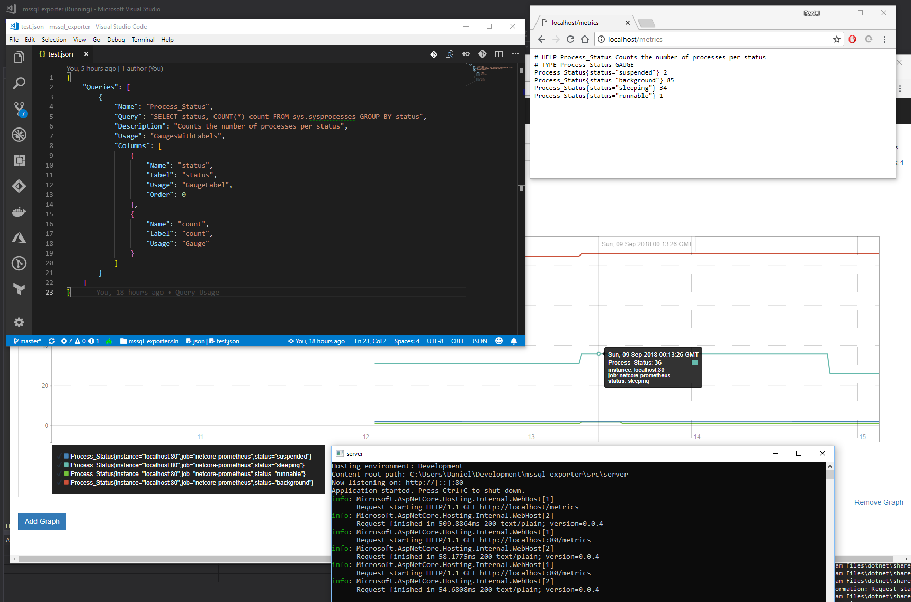

# mssql_exporter

MSSQL Exporter for Prometheus


| Appveyor | GitHub |
|---:|:---|
| [](https://ci.appveyor.com/project/DanielOliver/mssql-exporter/branch/master) | [](https://github.com/DanielOliver/mssql_exporter/releases/latest) |

## QuickStart

1. Download system of your choice from [latest release](https://github.com/DanielOliver/mssql_exporter/releases/latest).

2. Create a file "test.json" and  put this in it:

```json
{
    "Queries": [
        {
            "Name": "Process_Status",
            "Query": "SELECT status, COUNT(*) count FROM sys.sysprocesses GROUP BY status",
            "Description": "Counts the number of processes per status",
            "Usage": "GaugesWithLabels",
            "Columns": [
                {
                    "Name": "status",
                    "Label": "status",
                    "Usage": "GaugeLabel",
                    "Order": 0
                },
                {
                    "Name": "count",
                    "Label": "count",
                    "Usage": "Gauge"
                }
            ]
        }
    ]
}
```

3. Run mssql_exporter

```bash
./mssql_exporter serve -ConfigFile "test.json" -DataSource "Server=tcp:{ YOUR DATABASE HERE },1433;Initial Catalog={ YOUR INITIAL CATALOG HERE };Persist Security Info=False;User ID={ USER ID HERE };Password={ PASSWORD HERE };MultipleActiveResultSets=False;Encrypt=True;TrustServerCertificate=False;Connection Timeout=30;"
```

or

```powershell
.\mssql_exporter.exe serve -ConfigFile "test.json" -DataSource "Server=tcp:{ YOUR DATABASE HERE },1433;Initial Catalog={ YOUR INITIAL CATALOG HERE };Persist Security Info=False;User ID={ USER ID HERE };Password={ PASSWORD HERE };MultipleActiveResultSets=False;Encrypt=True;TrustServerCertificate=False;Connection Timeout=30;"
```

4. Open http://localhost/metrics

Content should look like 
```txt
# HELP Process_Status Counts the number of processes per status
# TYPE Process_Status GAUGE
Process_Status{status="suspended"} 2
Process_Status{status="background"} 85
Process_Status{status="sleeping"} 37
Process_Status{status="runnable"} 1
```

5. Add Prometheus scrape target (assuming same machine).

```yml
global:
  scrape_interval:     15s # Set the scrape interval to every 15 seconds. Default is every 1 minute.
  evaluation_interval: 15s # Evaluate rules every 15 seconds. The default is every 1 minute.
  
scrape_configs:
  - job_name: 'netcore-prometheus'
    # metrics_path defaults to '/metrics'
    static_configs:
    - targets: ['localhost']
```


## Example Image



## TODO

1. **DOCUMENT ALL METRIC CONFIGURATIONS.**
2. **DOCUMENT ALL MSSQL_EXPORTER ENVIRONMENT CONFIGURATIONS.**
